iOS8-Sampler
============

Code examples for the new functions of iOS 8.

##How to build

JUST BUILD basically, however please note below:

###Schemes

- Use "iOS8Sampler" Scheme for DEVICES.
- Use "iOS8SamplerSimulator" Scheme for SIMULATORS

This is because Metal can't be compiled for Simulators. When you have build error, try to delete the Derived Data: 

`/Users/shuichi/Library/Developer/Xcode/DerivedData/iOS8Sampler-{xxxxxxxxxx}`

###Provisioning Profile

When try the HealthKit or HomeKit examples, you have to use a provisioning profile for which HealthKit or HomeKit are enabled.

##Contents

###Audio Effects

Distortion and Delay effect for audio using AVAudioEngine.

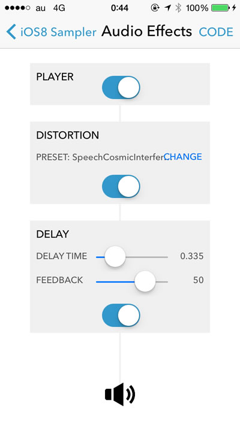

                   
###New Image Filters

New filters of CIFilter such as CIGrassDistortion, CIDivideBlendMode, etc...

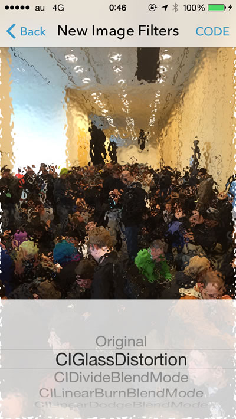

###Custom Filters

Custom CIFilter examples using CIKernel.

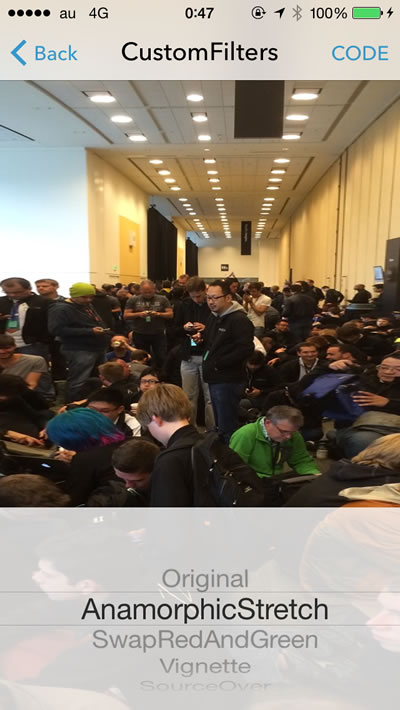

###Metal Basic

Render a set of cubes using Metal. Based on Apple's "MetalBasic3D" sample.

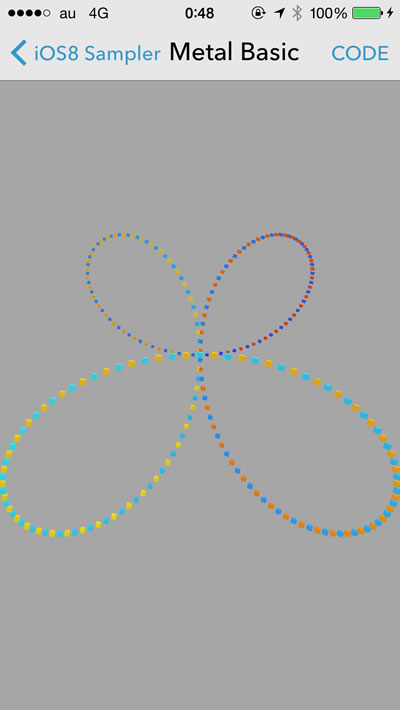

###Metal Uniform Streaming

Demo using a data buffer to set uniforms for the vertex and fragment shaders.

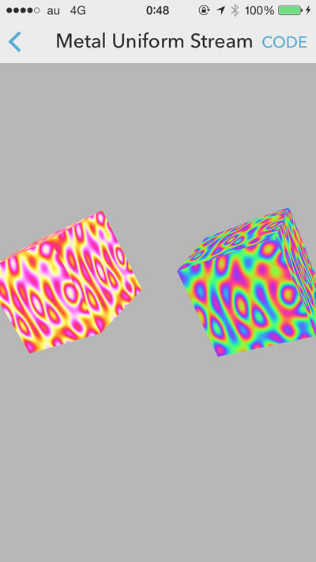

###SceneKit

Render a 2D image on 3D scene using SceneKit framework.

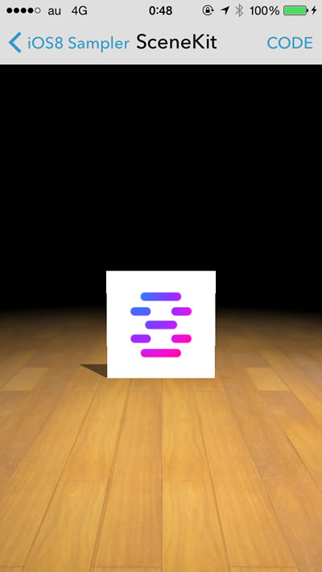

###HealthKit

Fetch all types of data which are available in HealthKit. Need to use a provisioning profile for which HealthKit is enabled.

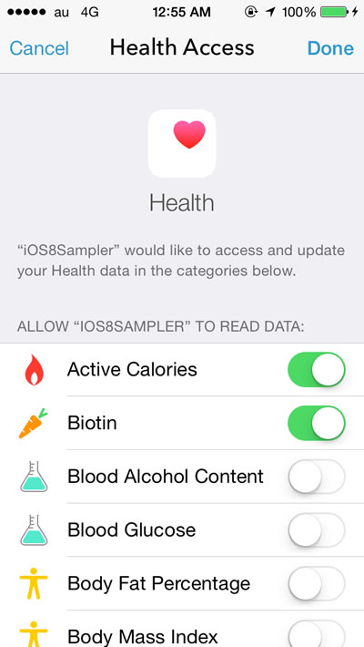

                   
###TouchID

Invoke Touch ID verification using LocalAuthentication.

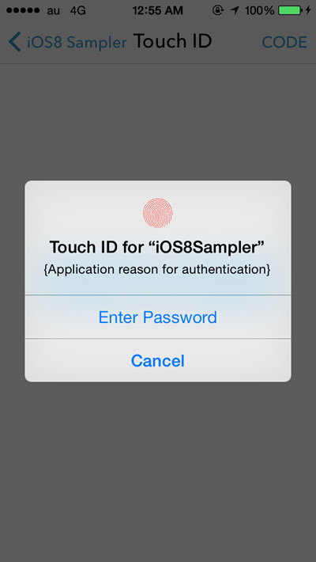

###Visual Effects

Example for UIBlurEffect and UIVibrancyEffect.

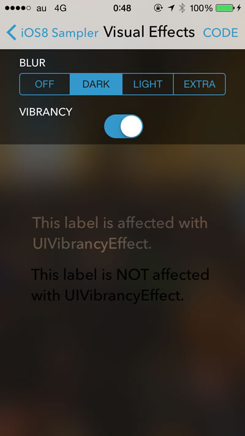

###Ruby Annotation

Display the pronunciation of characters using CTRubyAnnotationRef.

###WebKit

Browsing example using WKWebView.

###UIAlertController

Show Alert or ActionSheet using UIAlertController.

###User Notification

Schedule a local notification which has custom actions using UIUserNotificationSettings.

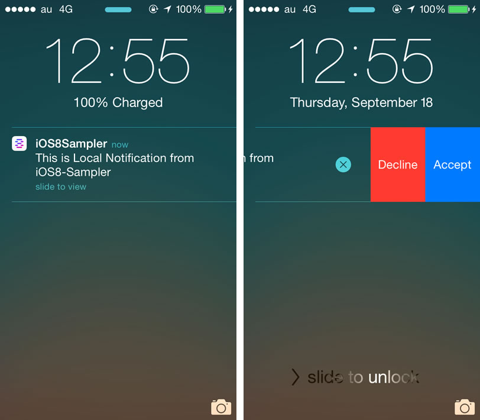

###Altimeter

Get relative altitude using CMAltimeter. It works only on devices which have M8 motion co-processor.

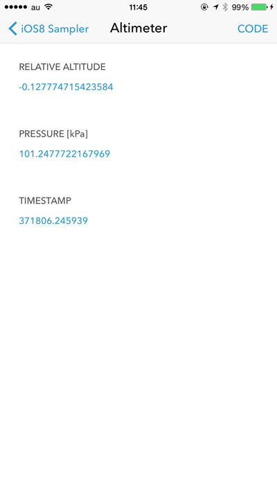

###Pedometer

Counting steps demo using CMPedometer. It works only on devices which have M7 or M8 motion co-processor.

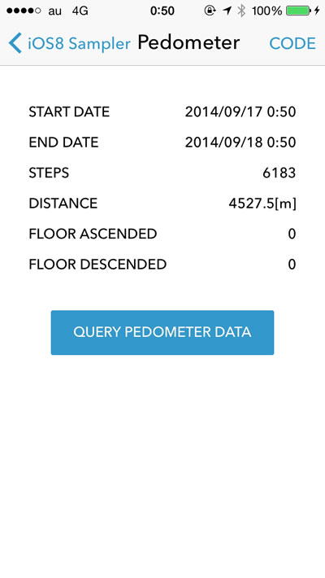

###AVKit

Media playback demo using AVKit framework.

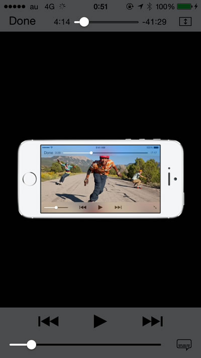

                   
###Histogram

Generate a histogram from an image using the filters CIAreaHistogram and CIHistogramDisplayFilter.

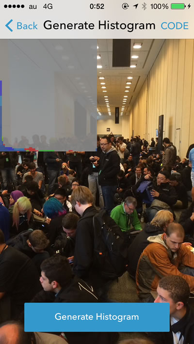

###Code Generator

Generate Aztec Code and 128 Barcord.

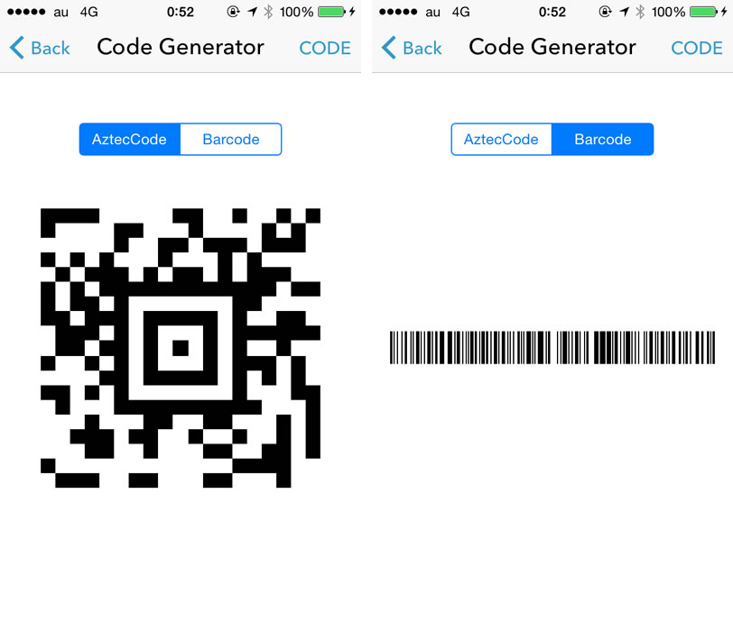

###New Fonts

Gallery of new fonts.

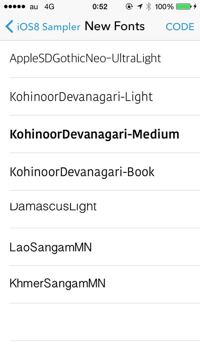

###Popover

Example of UIPopoverPresentationController.

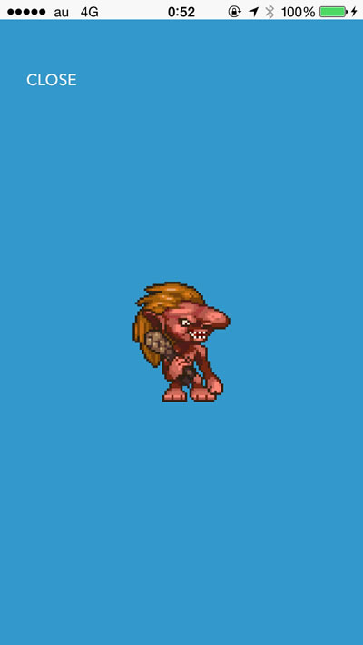

###Accordion Fold Transition

Transitions from one image to another by folding like accordion. However it doesn't work correctly...**PULL REQUESTS welcome**!!

##Author

Shuichi Tsutsumi

- [Twitter](https://twitter.com/shu223)
- [Facebook](https://www.facebook.com/shuichi.tsutsumi)
- [LinkedIn](https://www.linkedin.com/profile/view?id=214896557)
- [Blog (Japanese)](http://d.hatena.ne.jp/shu223/)

##Special Thanks

Icons and LaunchImages are **designed by [Okazu](https://www.facebook.com/pashimo)**
